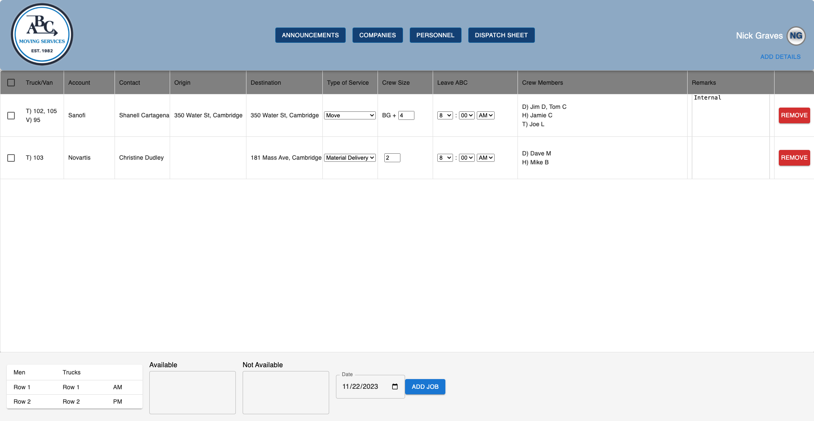

# ABC Internal System

## Description

Moving the day to day operations of ABC Moving Services from paper and pen to the computer. This application will allow the office to manage current and future jobs, billing, equipment tracking, history and more all on one central website. The workers, instead of being sent to jobs with a clipboard and a stack of papers, will have all necessary information available to them on their cell phone.

This project is proudly a work in progress.

## Table of Contents

- [Technologies Used](#technologies-used)
- [Current Implementations](#current-implementations)
- [Next Up Implementations](#next-up-implementations)

## Technologies Used

- Javascript
- Express.js
- React.js
- Node.js
- Apollo
- GraphQL
- MongoDB
- MUI

## Current Implementations

- An outside person does not have the ability to freely sign up. An owner of the company (already in database) has the ability to create or remove an individuals account.
- Currently, I only have the office users portion of the application written.

- When a user signs in, they are greeted to the home page.
  

- Selecting the companies button, will bring you to a list of all the companies ABC works with and the ability to add more or edit existing companies.
  

- Users are able to view a list of office or field employees and contacts. Here we are viewing the "Field Employees". (Employees such as Truck Drivers, Helpers and Technicians)
  

- The dispatch sheet is where jobs are initialized and saved to the database.
  

- Clicking on "Add Details" in the header will open the "Dispatch Drawer". This is where you add the initial details of the jobs of the selected date.
  

- On the home page, from the permanent drawer on the left. After clicking the "Jobs" dropdown, a date picker appears, after you've selected a date, all jobs for that date will be listed.
- After selecting a job, additional form fields will appear for you to fill in. Such as equiptment, billing, and other necessary information.
- (This feature is in the beginning stages of development.)
  

## Next Up Implementations

Home Page

- The History tab will allow a user to search for any combination dates, users, contacts, supervisors, equiptment etc. This will be a quick and easy way to reference jobs from the past.

- The Create tab will be used to produce new jobs outside of the dispatch sheet. Often times clients call ABC mid-day for service and the office workers need to create a new job sheet. Jobs can consist of moves, material deliveries/pickup, crate deliveries/pickup, fine-tune and job prep.

- The Equiptment tab will be a running tally of ABC's equiptment. We will keep track of the amount of equiptment that goes out on jobs, and the amount of equiptment that is returned from jobs. This will give ABC an idea of where they are losing assets. Notes will also be stored on how much equiptment was lost and on what job for retrieval on a later date.

- The Billing tab will be used by the office employees who handle payroll and the billing of clients. Currently, these employees are required to collect and compare hard copies of job, billing and payroll data. My plan is to automate that process, making everyones lives easier.

- The Availability tab will be used by an office employee to gather information from field employees on their availability for the upcoming work days. That data will then be transfered to the dispatch drawer for use in the dispatch sheet.

- The Time Off tab will only be accesible to the owners of the company, all employees will have the ability to request time off and that request will be stored in this tab for review.

Field Employee

- All field employees will receive general information about the job such as the start time, or if any personal protective equiptment is required.
- Depending on a field employees role for a given job, They will be sent certain information to their cell phone application.

- For example:
- If you are a driver on a job that has a supervisor, at the "Start Time" of the job, your account will display the origin and destination address of the job.
- If you are a driver on a job without a supervisor, at the "Start Time" of the job, your account will display the entire details of the job including all forms the client will need to sign off on after completion of the job. (If a supervisor is present, they will get the full details of the job)

- After completion of the job, all information will be organized and stored in the database and presented in the billing section.

Announcements

- All employees will be able to read announcements posted by Office employees.

Profile Page

- All users will have a profile page where they can update their personal information.

## The UX/UI design is currently in placeholder status, once the site is functional, a design overhaul will take place.
